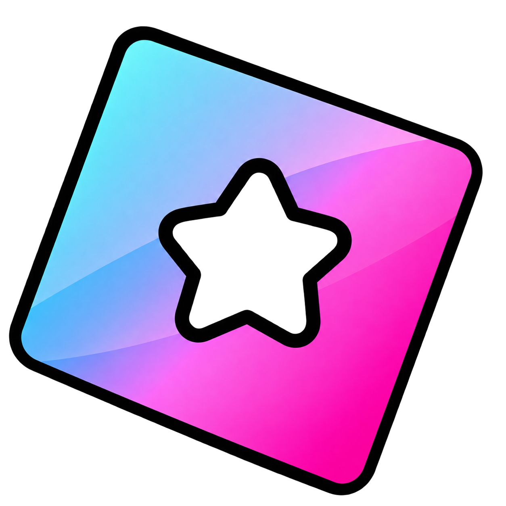

<p align="center">
  
</p>

# ✨ Roblox Customizer

> 🎨 Your Roblox, your style.

A browser extension for Chrome and Edge that adds custom backgrounds, frosted panels, and useful browsing tools to Roblox, with support for light and dark themes.

<p align="center">
  <kbd>Chrome & Edge</kbd> &nbsp; <kbd>Manifest V3</kbd> &nbsp; <kbd>Light & Dark Themes</kbd> &nbsp; <kbd>No Build Required</kbd>
</p>

[Features](#-features) · [Modified pages](#-pages--elements-modified) · [Installation](#-installation) · [Getting started](#-getting-started) · [Troubleshooting](#-troubleshooting) · [Project layout](#-project-layout)

---

## 🌟 Features

- **Animated backgrounds:** Use images, GIFs, or MP4 videos from a local file or HTTPS media URL. Choose whether the background fills the screen or shows the entire image, and adjust dimming.
- **Frosted interface:** Tune glass blur and opacity for menus and page panels, with styling that follows Roblox's light or dark theme. Interface features and layout improvements work with Roblox's default background; a custom wallpaper is optional.
- **Theme-aware controls:** Text, icons, inputs, menus, and extension settings switch with Roblox's theme. Light panels retain a minimum backing opacity to keep text readable over dark wallpapers.
- **Personalized Home:** Customize greetings and the clock, show up to three friend rows, and pin games. Hide Favorites, Standout Games, or the upper and lower recommendations separately; hide and restore individual recommended games.
- **Game browsing tools:** View badge information and public/private server details. Search public servers by country, latency, ping, and player count, or sort by player count.
- **Game data & social feeds:** Explore gamepasses, badges, and places using Roblox and Rolimons data. Browse X and YouTube feed panels where available, with separate visibility switches.
- **Robux currency estimates:** Display approximate purchase equivalents in your chosen currency across Roblox and Creator Hub. Actual checkout prices may vary.

## 🪄 Pages & elements modified

| Page or area | Route examples | What changes |
| --- | --- | --- |
| Home | `/home` | Greeting, clock, friends, pinned games, recommendation controls, and aligned game cards. |
| Game details | `/games/{id}` | Media and play controls, Store product cards and purchase controls, information panels, badges, server cards and filters, and social feeds. |
| Private-server configuration | `/private-server/configure/{id}` | Configuration panels, server name and link fields, access controls, and native save actions. |
| Game passes & Badges | `/game-pass/{id}`, `/badges/{id}` | Responsive artwork and detail panels, native purchase controls, and related experience links. |
| Charts | `/charts` | Game cards, browsing controls, and filter panels. |
| Marketplace | `/catalog`, `/catalog/{id}`, `/bundles/{id}` | Browsing cards, item and bundle previews, details, and resale panels. |
| Profiles & Avatar | `/users/{id}/profile`, `/my/avatar` | Profile sections, avatar previews, and editor panels. |
| Friends & Inventory | `/users/{id}/friends`, `/users/{id}/inventory` | Tabs, search controls, and list/card styling. |
| Account settings | `/my/account` | Settings navigation, Account Info and Robux panels, edit controls, personal forms, and social network fields. |
| Account & activity | `/plus`, `/my/messages`, `/trades`, `/transactions` | Membership, messaging, trading, and transaction panels. |
| Communities | `/search/communities`, `/communities/{id}`, `/communities/create` | Search results, community pages, and creation forms; legacy group routes are also supported. |
| Robux | `/upgrades/robux` | Purchase options and pricing panels. |
| Report Abuse | `/report-abuse` | Report form layout and styling. |
| Shared interface | Across the Roblox website | Backgrounds, navigation, dropdown menus, and chat panels. |

`{id}` represents a Roblox game, item, user, or community ID. Creator Hub receives Robux currency estimates; the full visual customization applies to the Roblox website.

## 🚀 Installation

1. Download or clone this repository. Extract the ZIP if you downloaded one.
2. Open `chrome://extensions` in Chrome or `edge://extensions` in Edge.
3. Enable **Developer mode**.
4. Click **Load unpacked** and select the folder containing `manifest.json`.
5. Open or refresh Roblox, then select **Roblox Customizer** from Roblox's settings gear menu.

No build step is required. Keep the unpacked extension folder in a permanent location so the browser can continue loading it.

## 🎛️ Getting started

Changes apply immediately and save automatically.

- **Set the mood:** Select a local background or paste a direct HTTPS media URL, then adjust image fit, dimming, blur, and opacity. GIFs and MP4 videos remain animated.
- **Make Home yours:** Set morning, afternoon, and evening greetings; choose 12- or 24-hour time, seconds, and date visibility; adjust friend rows and section switches.
- **Keep favorite games close:** Use the pin button beside Favorite on a game page. Your pinned games appear on Home with join and unpin controls.
- **Curate recommendations:** Click **Hide** on a recommended game. Restore it through **Hidden recommendations** in the plugin settings.
- **Find a server:** Open a game's Servers tab, set your filters, and click **Search**. Use **Previous/Next** to browse results or **Reset** to clear the filters.
- **Choose a currency:** Find a currency by name or code in the converter settings. Use **Refresh rates** to update available exchange rates.

## 🔄 Updating & removing

To update, replace the extension files with the new version, click the extension's reload button on the browser's extensions page, and refresh Roblox.

To restore the default background, select **Roblox default background** or **Remove background** in the plugin settings. Your other customizations remain active. To disable or uninstall the extension, use the browser's extensions page.

## 🛠️ Troubleshooting

| Issue | Try this |
| --- | --- |
| Extension or settings entry is missing | Confirm it is enabled, reload it, refresh Roblox, and reopen the settings gear menu. |
| Background does not appear | Use a direct HTTPS image/video URL or a local file. If automatic detection fails, select the URL format manually. |
| Server details, feeds, or rates are unavailable | Retry after a moment; these features depend on Roblox and external data services. |
| Layout looks unusual | Refresh Roblox and temporarily disable other Roblox extensions to check for conflicting styles. |

Preferences and pinned games are stored locally in your browser. Local background files are stored locally for reuse; URL backgrounds load from the address you provide.

## 🗂️ Project layout

```text
Roblox Customizer/
├── manifest.json          Extension entry point and permissions
├── icons/                 Extension icons and logo
├── src/
│   ├── background/        Service worker and background feature handlers
│   ├── shared/            Startup, page bridge, and shared interface styles
│   ├── settings/          Customizer settings and background controls
│   ├── home/              Friends layout and pinned games
│   ├── currency/          Robux conversion logic and display
│   └── pages/
│       ├── account/       Settings, messages, trades, and transactions
│       ├── avatar/        Avatar editor
│       ├── catalog/       Marketplace and item previews
│       ├── community/     Community pages and directory
│       ├── discovery/     Charts
│       ├── games/         Game details, badges, servers, and feeds
│       ├── profile/       User profiles
│       ├── reporting/     Report Abuse form
│       └── robux/         Robux purchase page
├── tests/                 Unit tests, browser fixtures, and package checks
├── README.md
└── LICENSE
```

Load the **repository root** containing `manifest.json` when installing the extension. Files under `src/` run directly without a build step.

## 💬 Feedback

When reporting a problem, include the Roblox page URL, browser version, steps to reproduce it, and a screenshot of the affected area. This helps identify the page and layout involved.

---

📄 Licensed under [GNU GPL v3](LICENSE).
